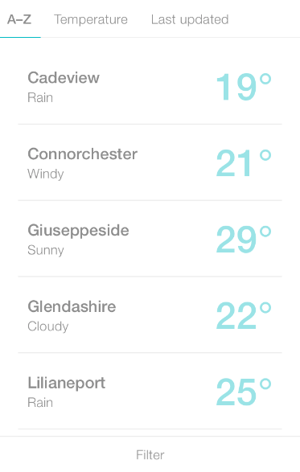

# Vue weather app



## Requirements:

Build a single page web app that generates and presents weather data to a user.
You will be developing an single page web app that will fetch and display the weather conditions.
Some sorting of the weather data will also be involved.

API Data:
http://dnu5embx6omws.cloudfront.net/venues/weather.json

Design:
https://projects.invisionapp.com/share/78EQZ5ESK#/screens/267017872

_Note:_

-   Ignore filter feature.
-   Please use ES6.
-   Use SCSS for stylesheet.

## Start building:

Clone repo

```
git clone git@bitbucket.org:punterswebteam/vue-weather-app.git
```

Create a new branch

```
git checkout -b [your-name]-weather-app-phase-1
```

Install dependencies and run on local, then you are good to go 🚀

```
$ npm install
$ npm run serve # dev server at http://localhost:8080
```

## Roadmap:

Create a branch for each phase, naming the branch as `[your-name]-weather-app-phase-1`, `[your-name]-weather-app-phase-2`..., once you finish the `todo` in each phase, send a PR to me, I will have a look and write some suggestion if necessary, meanwhile, feel free to write any comment or slack us directly if any question.

### Phase 1.

##### Todo:

-   Build the layout.

##### What you will learn:

-   Fundamental knowledge of HTML and CSS(SCSS).
-   Responsive design.
-   CSS framework: Bootstrap

##### Reference:

1. [SCSS Syntax](https://sass-lang.com/guide)
2. [Responsive Design](https://www.youtube.com/watch?v=ZYV6dYtz4HA)
3. [Bootstrap](https://getbootstrap.com/docs/4.3/getting-started/introduction/)

### Phase 2.

##### Todo:

-   Client side rendering logic switch like `A-Z`, `Template`, `Last update`.

##### What you will learn:

-   Add click event listener to HTML element.
-   Dom manipulation. (Remove and add HTML element in JavaScript)
-   Data transformation.

##### Reference:

1. [addEventListener](https://developer.mozilla.org/ja/docs/Web/API/EventTarget/addEventListener)
2. [Sort method in JavaScript](https://developer.mozilla.org/ja/docs/Web/JavaScript/Reference/Global_Objects/Array/sort)

### Phase 3.

##### Todo:

-   Fetch real API endpoint and implement data into HTML elements.

##### What you will learn:

-   JavaScript API calling adn fetch function.

##### Reference:

1. [Fetch を使う
   ](https://developer.mozilla.org/ja/docs/Web/API/Fetch_API/Using_Fetch)
